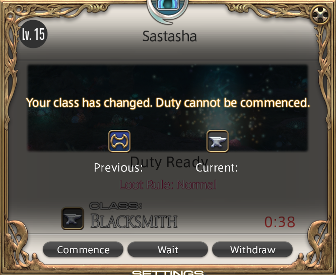

# JobAutoSwitcher

**JobAutoSwitcher** is a Dalamud plugin for *Final Fantasy XIV* that solves the annoyance of the "Class/Job is different" error in the Duty Finder.

If you queue for a duty as one job, switch to another (e.g., to craft, gather, or play a different role) while waiting, and then click **Commence** when the duty pops, the game normally blocks you with this error:

**JobAutoSwitcher fixes this instantly.** You don't have to manually switch back. Just click **Commence**, and the plugin will:
1.  Detect the job you queued with.
2.  Automatically find and equip your gearset with the **highest Item Level** for that job.
3.  Enter the duty for you seamlessly.

## Features
* **Auto-Switching:** Instantly detects the job required for the duty and switches your gearset.
* **Smart Gear Selection:** Automatically picks the gearset with the **highest Item Level** if you have multiple sets for the same job (e.g. one for PvP, one for Raiding).
* **Seamless Entry:** Bypasses the error message and automatically clicks "Commence" again once the switch is complete.
* **Lag Proof:** Includes a smart retry loop that ensures you enter the duty even if you are stuck in an animation lock (like crafting or casting) when you click.

## Installation
1.  Open **Dalamud Settings**.
2.  Go to the **Experimental** tab.
3.  Add the path to your `JobAutoSwitcher.json` (or the folder containing it) to the **Dev Plugin Locations**.
4.  Enable the plugin in the main plugin installer/list.

## Usage
1.  Queue for a duty as **Job A**.
2.  Switch to **Job B** while waiting for the queue to pop.
3.  When the "Duty Ready" window appears, simply click **Commence**.
4.  The plugin will handle the rest!

## Technical Details
* **Detection:** Uses the Job Icon ID from the `ContentsFinderConfirm` addon to calculate the required Job ID (`IconID - 62100`).
* **Switching:** Interfaces directly with the `RaptureGearsetModule` to equip gearsets by ID, ensuring reliability regardless of gearset names.
* **Safety:** Uses `AddonLifecycle` hooks to ensure stability across game updates.

## License
Distributed under the GNU Affero General Public License v3.0 (AGPL-3.0). See `LICENSE` for more information.